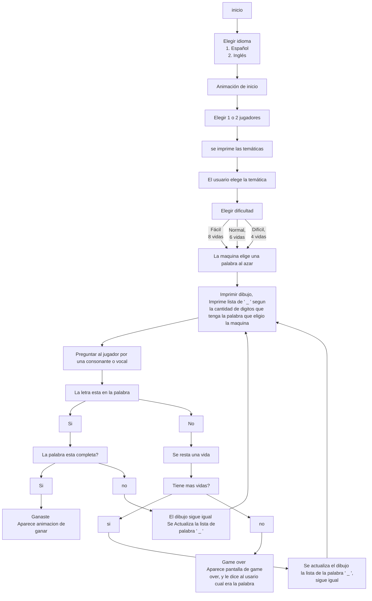

# Hangman Game made by pyth - OHM
## Bibliotecas
##### Import random\
La biblioteca import random nos sirve para importar el módulo random, que nos da funciones para generar números aleatorios y hacer selecciones aleatorias.
Al importar random, se obtiene acceso a funciones como random.random() , random.randint() y random.choice() 
+ random.choice()\
La función random.choice() en Python nos permite elegir de manera aleatoria un elemento de una secuencia, como una lista, una tupla o una cadena de caracteres. En otras palabras, nos brinda la capacidad de seleccionar un elemento al azar de un conjunto de opciones.\
Daurante la elaboracion de juego utilizamos la funcion para escoger una palabra aletoria dentro de la lista llamada "lista" y a esta esta palabra generada darle la variable "y" la cual seria la palabra que el jugador debe adivinar.
 ```python 
palabra = (random.choice(lista[y])).upper() 
   ```
##### Import time\
La biblioteca time nos permite manipular y controlar el tiempo en un programa.
Ofrece funciones para agregar retardos con time.sleep(), obtener la hora actual con time.time(), obtener la hora local con time.localtime(), y formatear la hora y fecha con time.strftime().
+ time.sleep() \
La función time.sleep() nos permite hacer una pausa en la ejecución de un programa durante un tiempo determinado.Duranre el codigo la utilizamos para distaciar temporalmente las "imagenes " del ahorcado.
```python
time.sleep()
 ```
##### Import Os
La biblioteca ´os´  nos permite interactuar con el sistema operativo en el que se ejecuta el programa.
Proporciona funciones para manipular archivos y directorios, acceder a variables de entorno del sistema, ejecutar comandos del sistema, manipular rutas de archivos y obtener información del sistema operativo.
Usamos las siguientes  funciones:
  ```python
def clear():#
  if os.name == "nt": #para verificar si el sistema operativo en el que se está ejecutando el programa es Windows. La variable os.name almacena el nombre del sistema operativo.
    os.system("cls")#Este comando  se encarga de limpiar la pantalla de la terminal.
  else: # en casi de que el sistema operativo no sea windows se utiliza la siguiente funcion
    os.system("clear")#Este comando  se encarga de limpiar la pantalla de la terminal en caso de que no sea windows.
   ```
## Funcionamiento logico del juego


## Funciones

+ def palabras(idioma):
<details><summary> Funcion :</summary><p> 
  
``` python
def palabras(idioma):
    """
    Esta función devuelve un diccionario de palabras según el idioma seleccionado.
    
    Argumentos:
        - idioma: entero que representa el idioma seleccionado.
        
    Retorna:
        - lista: Un diccionario con el nombre lista, de palabras correspondiente al idioma seleccionado.
    """
    if idioma==1: 
        lista = {
        1 : #Frutas
            ["arandano", "frambuesa", "fresa", "grosella", "limon", "mandarina", "naranja", "pomelo", "aguacate", "carambola", "chirimoya", "coco", "datil", "kiwi", "mango", "papaya", "pina", "platano", "cereza", "ciruela", "kaki", "manzana", "melocoton", "nispero", "pera", "uva", "almendra", "avellana", "cacahuete", "castana", "nuez"],

        2 : #Superheroes
            ["antman", "aquaman", "atom", "batgirl", "batman", "blackpanther", "blackwidow", "blade", "bluebeetle", "booster", "cable", "captainamerica", "captainmarvel", "catwoman", "colossus", "cyclops", "daredevil", "deadpool", "doctorfate", "doctorstrange", "elektra", "falcon", "firestorm", "flash", "gambit", "ghostrider", "greenarrow", "greenlantern", "groot", "hawkeye", "hellboy", "hulk", "humantorch", "huntress", "iceman", "invisiblewoman", "ironfist", "ironman", "jeangrey", "joker", "jubilee", "juggernaut", "kittypryde", "loki", "lukecage", "magneto", "martianmanhunter", "misterfantastic", "moonknight", "msmarvel", "mystique", "namorita", "nightcrawler", "nightwing", "nova", "omegared", "phoenix", "plasticman", "poisonivy", "powergirl", "professorxavier", "psylocke", "punisher", "quicksilver", "raven", "redhood", "robin", "rocketeer", "rogue", "sabretooth", "scarletwitch", "shadowcat", "shazam", "shehulk", "silversurfer", "spiderman", "starfire", "storm", "submariner", "supergirl", "superman", "swampthing", "thing", "thor", "tigra", "venom", "vision", "warmachine", "wasp", "watchmen", "wolverine", "wonderwoman", "zatanna"] ,      

        3 : #animales
            ["perro", "gato", "elefante", "jirafa", "leon", "tigre", "lobo", "oso", "cebra", "hipopotamo", "rinoceronte", "vaca", "oveja", "cerdo", "conejo", "raton", "ardilla", "pato", "pavo", "gallina", "gallo", "pajaro", "loro", "pinguino", "tortuga", "cocodrilo", "serpiente", "lagarto", "camaleon", "rana", "sapo", "tiburon", "ballena", "delfin", "pez", "caballo", "burro", "cebra", "avestruz", "canguro", "koala", "panda", "camello", "hormiga", "abeja", "araña", "escarabajo", "mariposa", "mosquito"],

        4 : # Paises
            ["argentina", "australia", "brasil", "canada", "china", "colombia", "egipto", "espana", "estados unidos", "francia", "india", "inglaterra", "italia", "japon", "mexico", "peru", "rusia", "sudafrica", "suiza", "tailandia", "turquia", "uruguay", "venezuela", "alemania", "arabia saudita", "belgica", "chile", "dinamarca", "ecuador", "filipinas", "grecia", "holanda", "indonesia", "irlanda", "israel", "kenia", "malasia", "noruega", "nueva zelanda", "panama", "polonia", "portugal", "republica checa", "singapur", "suecia", "vietnam", "cuba", "costa rica", "honduras", "nicaragua"],
            
        5 : # Medios de transporte
            ["automovil", "camion", "motocicleta", "bicicleta", "autobus", "triciclo", "carroza", "furgoneta", "remolque", "tren", "tranvia", "barco", "yate", "avion", "helicoptero", "coche de carreras", "camioneta", "caravana", "patineta", "grua", "excavadora", "ambulancia", "motonieve", "carretilla", "carro de golf", "tractor", "segway", "carro de bomberos", "trineo", "hidroavion", "carro de caballos", "tanque", "submarino", "quad", "carro blindado", "trailer", "monopatin", "aerodeslizador", "tuktuk", "carro de combate", "grua movil", "autobus escolar", "moto de agua", "globo aerostatico", "trolley", "mototaxi", "carro de helados", "autogiro", "carro de reparto", "tren de alta velocidad"],

        6 : # Partes del cuerpo
            ["cabeza", "cuello", "hombro", "brazo", "codo", "muneca", "mano", "dedo", "una", "pecho", "espalda", "estomago", "cintura", "cadera", "pierna", "rodilla", "tobillo", "pie", "talon", "dedo del pie", "una del pie", "ojo", "ceja", "parpado", "nariz", "oreja", "labio", "diente", "barbilla", "mejilla", "lengua", "mandibula", "cerebro", "corazon", "pulmon", "higado", "rinon", "intestino", "vertebra", "musculo", "tendon", "arteria", "vena", "piel", "unas", "cabello", "sangre", "hueso", "articulacion", "glandula"],

        7 : # Objetos del hogar
            ["sofa", "mesa", "silla", "televisor", "librero", "cama", "lampara", "nevera", "lavadora", "secadora", "cocina", "horno", "microondas", "tostadora", "batidora", "platos", "vasos", "cubiertos", "ollas", "sartenes", "tetera", "cafetera", "taza", "espejo", "cepillo de dientes", "pasta de dientes", "toallas", "ducha", "banera", "inodoro", "lavabo", "escoba", "recogedor", "aspiradora", "cubo de basura", "cortinas", "persianas", "estante", "cajones", "armario", "ropa", "zapatos", "escritorio", "ordenador", "impresora", "telefono", "cargador", "ventana", "puerta", "escaleras"],

        8 : # Prendas de vestir
            ["camiseta", "pantalones", "vestido", "chaqueta", "falda", "camisa", "zapatos", "calcetines", "shorts", "chaqueta de cuero", "blusa", "sombrero", "abrigo", "sueter", "pantalones cortos", "traje", "chaqueta vaquera", "corbata", "gafas de sol", "bufanda", "botas", "chaleco", "mono", "chaqueta deportiva", "traje de bano", "pajarita", "sudadera", "gorra", "guantes", "pantalones de yoga", "chaqueta acolchada", "falda lapiz", "jersey", "top", "pantalones vaqueros", "panuelo", "traje formal", "camiseta sin mangas", "esmoquin", "kimono", "polo", "zapatillas deportivas", "sombrero de paja", "blazer", "chaqueta de esqui", "chaqueta bomber", "vaqueros ajustados", "camiseta de tirantes", "blusa de seda", "chaqueta militar", "vestido de coctel", "chandal", "sudadera con capucha", "camisa hawaiana", "leggings", "chaqueta cortavientos", "vestido de noche", "polo de golf", "chaqueta de punto", "pantalones de traje", "camiseta estampada", "kimono de seda", "cazadora", "blusa de encaje", "mono corto", "pantalones cargo", "tunica", "bermudas", "camiseta de rayas", "vestido maxi"],

        9 : # Generos musicales
            ["rock", "pop", "jazz", "hiphop", "electronica", "reggae", "country", "blues", "salsa", "metal", "folk", "funk", "reggaeton", "clasica", "indie", "rap", "rhythmandblues", "soul", "punk", "dance", "disco", "alternativa", "house", "ranchera", "ska", "latino", "regionalmexicano", "cumbia", "tango", "flamenco", "merengue", "bachata", "vallenato", "samba", "bossanova", "gospel", "grunge", "techno", "trap", "hardrock", "rockandroll", "soul", "jpop", "kpop", "musicaclassica", "opera", "musicafolklorica", "heavymetal", "jazzfusion", "punkrock", "poprock", "musicainstrumental", "musicacountry", "musicaelectronica", "folkrock", "musicaindie", "musicatropical", "musicaurbana", "musicaexperimental", "musicaambiental", "regueton", "mariachi", "bluegrass", "technopop", "triphop", "musicadisco", "generobarroco", "musicaminimalista", "musicamedieval", "musicarenacentista"]
        ,
        10 : # Escritores famosos
            ["williamshakespeare", "janeausten", "charlesdickens", "marktwain", "emilybronte", "fyodordostoevsky", "leotolstoy", "virginiawoolf", "ernesthemingway", "franzkafka", "georgeorwell", "gabrielgarciamarquez", "jorgeluisborges", "migueldecervantes", "marcelproust", "jamesjoyce", "hermannhesse", "victorhugo", "charlottebronte", "agathachristie", "harperlee", "jrrtolkien", "cslewis", "aldoushuxley", "johnsteinbeck", "oscarwilde", "arthurconandoyle", "hgwells", "georgerrmartin", "tonimorrison", "ralphwaldoemerson", "henrydavidthoreau", "waltwhitman", "edgarallanpoe", "homer", "hplovecraft", "fscottfitzgerald", "rudyardkipling", "salmanrushdie", "italocalvino", "albertcamus", "antonchekhov", "dantealighieri", "julesverne", "thomasmann", "josesaramago", "gustaveflaubert", "albertomoravia", "mariovargasllosa", "johnmilton", "samuelbeckett", "paulocoelho", "stefanzweig", "umbertoeco", "williamfaulkner", "kurtvonnegut", "alexandredumas", "hanschristianandersen", "trumancapote", "johnupdike", "margaretatwood", "grahamgreene", "nathanielhawthorne", "sylviaplath", "ernestosabato", "octaviopaz", "isaacasimov", "vladimirnabokov", "yukiomishima", "edithwharton", "emilydickinson", "jackkerouac", "charlesbaudelaire", "mikhailbulgakov", "edgarriceburroughs", "roalddahl", "samueltaylorcoleridge", "wsomersetmaugham", "jorgeamado", "pabloneruda", "tseliot", "jdsalinger", "dorislessing", "mariodeandrade", "jrrmartin", "philipkdick", "whauden", "mariannemoore", "yukiomishima", "rabindranathtagore", "claricelispector", "vikramseth", "kazuoishiguro", "chinuaachebe", "jeanpaulsartre"],

        11 : # Equipos de futbol
            ["real madrid", "barcelona", "manchester united", "bayern munich", "liverpool", "juventus", "paris saint-germain", "chelsea", "manchester city", "arsenal", "ac milan", "inter de milan", "atletico madrid", "borussia dortmund", "tottenham hotspur", "roma", "napoli", "ajax", "benfica", "porto", "boca juniors", "river plate", "flamengo", "santos", "palmeiras", "cruzeiro", "são paulo", "grêmio", "internacional", "corinthians", "colo-colo", "universidad de chile", "américa", "chivas", "pumas", "monterrey", "tigres", "santos laguna", "olimpia", "motagua", "alianza", "fas", "comunicaciones", "municipal", "marathon", "seattle sounders", "los angeles fc", "atlanta united", "new york city fc", "la galaxy", "toronto fc", "montreal impact", "club america", "toluca", "cruz azul", "pachuca", "leon", "tigres uanl", "saprissa", "alajuelense", "herediano", "cartagines", "olimpia", "real espana", "motagua"],

        12 : # Jugadores de Futbol
            ["lionel messi", "cristiano ronaldo", "neymar jr", "kylian mbappe", "robert lewandowski", "mohamed salah", "kevin de bruyne", "sergio ramos", "virgil van dijk", "luka modric", "harry kane", "sadio mane", "manuel neuer", "eden hazard", "antoine griezmann", "paul pogba", "karim benzema", "gareth bale", "david de gea", "sergio aguero", "thiago alcantara", "raheem sterling", "toni kroos", "joshua kimmich", "pierre-emerick aubameyang", "thomas muller", "marc-andre ter stegen", "alisson becker", "romelu lukaku", "jan oblak", "bernardo silva", "angel di maria", "jadon sancho", "marco reus", "son heung-min", "david silva", "sergio busquets", "trent alexander-arnold", "fabinho", "marcelo", "aymeric laporte", "andrew robertson", "hakim ziyech", "heung-min son", "riyad mahrez", "kalidou koulibaly", "ngolo kante", "ciro immobile", "thibaut courtois", "matthijs de ligt", "edinson cavani", "angel correa", "lucas moura", "thomas partey", "dani carvajal", "erling haaland", "douglas costa", "kingsley coman", "koke", "mats hummels", "christian pulisic", "hirving lozano", "alex sandro", "eduardo salvio", "giovani lo celso", "ricardo pereira", "joao cancelo", "diego godin", "vinicius jr", "zlatan ibrahimovic", "aaron wan-bissaka", "wilfried zaha", "andrea belotti", "wissam ben yedder", "dries mertens", "jamie vardy", "romelu lukaku", "alexandre lacazette", "luis suarez", "lautaro martinez", "memphis depay", "pierre-emerick aubameyang", "marcus rashford", "tammy abraham", "bruno fernandes", "serge gnabry", "frenkie de jong", "rodrigo bentancur", "youri tielemans", "jordan henderson"],

        13: #Cantantes famosos
            ["adele", "ariana grande", "beyonce", "bob marley", "bruno mars", "celine dion", "chris brown", "david bowie", "ed sheeran", "elton john", "eminem", "enrique iglesias", "frank sinatra", "freddie mercury", "george michael", "jennifer lopez", "john lennon", "justin bieber", "justin timberlake", "katy perry", "lady gaga", "madonna", "michael jackson", "miley cyrus", "nicki minaj", "prince", "queen", "rihanna", "robbie williams", "sia", "stevie wonder", "taylor swift", "usher", "whitney houston", "adele", "alanis morissette", "alicia keys", "amy winehouse", "avrillavigne", "barbra streisand", "billie eilish", "bjork", "carrie underwood", "celine dion", "cher", "christina aguilera", "cyndi lauper", "demi lovato", "dolly parton", "don omar", "dua lipa", "elvis presley", "florence welch", "gwen stefani", "iggy pop", "james brown", "janis joplin", "jimi hendrix", "joan baez", "joan jett", "johnny cash", "kanye west", "kelly clarkson", "lana del rey", "lenny kravitz", "leonard cohen", "louis armstrong", "ludwig van beethoven", "mariah carey", "mary j blige", "mick jagger", "natalie cole", "nina simone", "paul mccartney", "pink", "prince", "ricky martin", "shakira", "sinead o'connor", "steve wonder", "tina turner", "tony bennett", "tupac shakur", "victor jara", "whitney houston", "willie nelson"],

        14:# Razas de perros
            ["bulldog", "labrador retriever", "golden retriever", "german shepherd", "poodle", "beagle", "boxer", "rottweiler", "dachshund", "siberian husky", "great dane", "chihuahua", "pomeranian", "shih tzu", "yorkshire terrier", "doberman pinscher", "boston terrier", "pug", "border collie", "australian shepherd", "basset hound", "cocker spaniel", "dalmatian", "french bulldog", "italian greyhound", "cavalier king charles spaniel", "english springer spaniel", "bull terrier", "chow chow", "shiba inu", "weimaraner", "vizsla", "west highland white terrier", "papillon", "newfoundland", "rhodesian ridgeback", "bichon frise", "shetland sheepdog", "staffordshire bull terrier", "afghan hound", "akita", "american bulldog", "american eskimo dog", "american staffordshire terrier", "basenji", "bloodhound", "borzoi", "brittany spaniel", "brussels griffon", "bullmastiff", "chinese crested", "clumber spaniel", "corgi", "english bulldog", "english cocker spaniel", "english setter", "english toy spaniel", "giant schnauzer", "gordon setter", "havanese", "irish setter", "irish wolfhound", "japanese chin", "keeshond", "komondor", "kuvasz", "leonberger", "lhasa apso", "maltese", "miniature pinscher", "newfoundland", "norfolk terrier", "norwegian elkhound", "old english sheepdog", "otterhound", "papillon", "pekingese", "pembroke welsh corgi", "pharaoh hound", "pointer", "pomeranian", "poodle", "portuguese water dog", "redbone coonhound", "saluki", "samoyed", "schipperke", "scottish terrier", "shetland sheepdog", "shih tzu", "siberian husky", "silky terrier", "skye terrier", "soft coated wheaten terrier", "staffordshire bull terrier", "standard schnauzer", "vizsla", "weimaraner", "welsh springer spaniel", "west highland white terrier", "whippet", "wirehaired pointing griffon"],

        15:#Utiles Escolares
            ["lapiz", "pluma", "cuaderno", "libro", "goma de borrar", "regla", "tijeras", "pegamento", "calculadora", "mochila", "marcadores", "compas", "lapicero", "papel", "lapices de colores", "carpeta", "borrador", "pincel", "cinta adhesiva", "libreta", "subrayadores", "corrector", "esferos", "postits", "agenda", "grapadora", "papel de calcar", "cartulina", "lamina de acetato", "cartuchos de tinta", "resaltadores", "temperas", "borrador de tinta", "punta de recambio para boligrafo", "sacapuntas", "lapicera", "libros de referencia", "tijeras de precision", "agenda escolar", "compas escolar", "goma de borrar blanca", "maquina de escribir", "calendario", "fichas de estudio", "calculadora cientifica", "puntero laser", "estuche", "pizarra blanca", "borrador de pizarra", "carpetas de plastico", "etiquetas adhesivas"],

        16:#peliculas famosas
            ["el padrino", "el senor de los anillos: el retorno del rey", "casablanca", "titanic", "el rey leon", "pulp fiction", "forrest gump", "el caballero de la noche", "la lista de schindler", "el gran dictador", "ciudadano kane", "cadena perpetua", "matrix", "el club de la pelea", "regreso al futuro", "la vida es bella", "el silencio de los corderos", "star wars: episodio iv - una nueva esperanza", "apocalipsis ahora", "gladiador", "avatar", "el resplandor", "memento", "intocable", "el sexto sentido", "inception", "el pianista", "el bueno, el malo y el feo", "el exorcista", "el gran gatsby", "la la land", "el viaje de chihiro", "buenos muchachos", "el lobo de wall street", "el senor de los anillos: la comunidad del anillo", "ratatouille", "el padrino: parte ii", "el rey leon", "el club de los cinco", "reservoir dogs", "la naranja mecanica", "el renacido", "piratas del caribe: la maldicion del perla negra", "el curioso caso de benjamin button", "el aviador", "los siete samurais", "cantando bajo la lluvia", "blade runner", "el gran lebowski", "taxi driver", "el septimo sello", "psicosis", "cinema paradiso", "el golpe", "el laberinto del fauno", "el graduado", "cisne negro", "el club de la pelea", "el resplandor", "la vida de los otros", "el ilusionista", "la princesa prometida", "el viaje de chihiro", "la guerra de las galaxias: episodio v - el imperio contraataca", "inception", "el gran dictador", "gladiador", "la trilogia de el senor de los anillos"],

        17: # Pokemon
            ["Pikachu", "Charizard", "Mewtwo", "Mew", "Gyarados", "Dragonite", "Blastoise", "Venusaur","Arcanine", "Alakazam", "Gengar", "Jolteon", "Flareon", "Vaporeon", "Lapras", "Snorlax", "Tyranitar", "Ampharos", "Espeon", "Umbreon", "Scizor" , "Blaziken", "Swampert", "Sceptile", "Gardevoir", "Salamence", "Metagross", "Aggron", "Groudon","Kyogre", "Rayquaza", "Latios", "Latias", "Breloom", "Flygon", "Altaria", "Absol", "Manectric","Sharpedo", "Infernape", "Empoleon", "Torterra", "Lucario", "Garchomp", "Roserade", "Staraptor", "Luxray","Dialga", "Palkia", "Gallade", "Magnezone", "Togekiss", "Weavile", "Yanmega", "Honchkrow","Gastrodon", "Rhyperior", "Electivire", "Magmortar", "Leafeon", "Glaceon", "Mamoswine", "Tangrowth","Dusknoir", "Froslass", "Samurott", "Emboar", "Serperior", "Zoroark", "Hydreigon", "Galvantula", "Krookodile", "Cofagrigus","Chandelure", "Haxorus", "Volcarona", "Eelektross", "Carracosta", "Archeops", "Excadrill", "Bisharp","Mandibuzz", "Braviary","Greninja", "Delphox", "Chesnaught", "Talonflame", "Aegislash", "Hawlucha", "Goodra", "Noivern","Sylveon", "Aurorus", "Tyrantrum", "Malamar", "Barbaracle"]
            }
    elif idioma==2: 
        lista = {


        1 : #Fruits
            ["blueberry", "raspberry", "strawberry", "currant", "lemon", "tangerine", "orange", "grapefruit", "avocado", "starfruit", "cherimoya", "coconut", "date", "kiwi", "mango", "papaya", "pineapple", "banana", "cherry", "plum", "persimmon", "apple", "peach", "loquat", "pear", "grape", "almond", "hazelnut", "peanut", "chestnut", "walnut"] ,
                    
        2 : #Superheroes
            ["antman", "aquaman", "atom", "batgirl", "batman", "blackpanther", "blackwidow", "blade", "bluebeetle", "booster", "cable", "captainamerica", "captainmarvel", "catwoman", "colossus", "cyclops", "daredevil", "deadpool", "doctorfate", "doctorstrange", "elektra", "falcon", "firestorm", "flash", "gambit", "ghostrider", "greenarrow", "greenlantern", "groot", "hawkeye", "hellboy", "hulk", "humantorch", "huntress", "iceman", "invisiblewoman", "ironfist", "ironman", "jeangrey", "joker", "jubilee", "juggernaut", "kittypryde", "loki", "lukecage", "magneto", "martianmanhunter", "misterfantastic", "moonknight", "msmarvel", "mystique", "namorita", "nightcrawler", "nightwing", "nova", "omegared", "phoenix", "plasticman", "poisonivy", "powergirl", "professorxavier", "psylocke", "punisher", "quicksilver", "raven", "redhood", "robin", "rocketeer", "rogue", "sabretooth", "scarletwitch", "shadowcat", "shazam", "shehulk", "silversurfer", "spiderman", "starfire", "storm", "submariner", "supergirl", "superman", "swampthing", "thing", "thor", "tigra", "venom", "vision", "warmachine", "wasp", "watchmen", "wolverine", "wonderwoman", "zatanna"] ,      
            
        3 : #Animals
            ["dog", "cat", "elephant", "giraffe", "lion", "tiger", "wolf", "bear", "zebra", "hippopotamus","rhinoceros","cow","sheep","pig","rabbit","mouse","squirrel","duck","turkey","hen","rooster","bird","parrot","penguin","turtle","crocodile","snake","lizard","chameleon","frog","toad","shark","whale","dolphin","fish","horse","donkey","zebra","ostrich","kangaroo","koala","panda","camel","ant","bee","spider","beetle","butterfly","mosquito"],

        4 : #Countries
            ["Argentina", "Australia", "Brazil", "Canada", "China","Colombia","Egypt","Spain","United States","France","India","England","Italy","Japan","Mexico","Peru","Russia","South Africa","Switzerland","Thailand","Turkey","Uruguay","Venezuela","Germany","Saudi Arabia","Belgium","Chile","Denmark","Ecuador","Philippines","Greece","Netherlands","Indonesia","Ireland","Israel","Kenya","Malaysia","Norway","New Zealand","Panama","Poland","Portugal", "Czech Republic", "Singapore", "Sweden", "Vietnam", "Cuba", "Costa Rica", "Honduras", "Nicaragua"],

        5: # Means of transportation
            ["car", "truck", "motorcycle", "bicycle", "bus", "tricycle", "carriage", "van", "trailer", "train", "tram", "boat", "yacht", "airplane", "helicopter", "race car", "van", "RV", "skateboard", "crane", "excavator", "ambulance", "snowmobile", "wheelbarrow", "golf cart", "tractor", "Segway", "firetruck", "sled", "seaplane", "horse-drawn carriage", "tank", "submarine", "quad", "armored car", "trailer", "scooter", "hovercraft", "tuk-tuk", "tank", "mobile crane", "school bus", "jet ski", "hot air balloon", "trolley", "mototaxi", "ice cream truck", "autogyro", "delivery truck", "bullet train"],

        6: # Parts of the body
            ["head", "neck", "shoulder", "arm", "elbow", "wrist", "hand", "finger", "thumb", "chest", "back", "stomach", "waist", "hip", "leg", "knee", "ankle", "foot", "heel", "toe", "eye", "eyebrow", "eyelid", "nose", "ear", "lip", "tooth", "chin", "cheek", "tongue", "jaw", "brain", "heart", "lung", "liver", "kidney", "intestine", "vertebra", "muscle", "tendon", "artery", "vein", "skin", "nail", "hair", "blood", "bone", "joint", "gland"],

        7: # Household objects
            ["sofa", "table", "chair", "television", "bookshelf", "bed", "lamp", "refrigerator", "washing machine", "dryer", "kitchen", "oven", "microwave", "toaster", "blender", "plates", "glasses", "silverware", "pots", "pans", "kettle", "coffee maker", "cup", "mirror", "toothbrush", "toothpaste", "towels", "shower", "bathtub", "toilet", "sink", "broom", "dustpan", "vacuum cleaner", "trash can", "curtains", "blinds", "shelf", "drawers", "wardrobe", "clothes", "shoes", "desk", "computer", "printer", "telephone", "charger", "window", "door", "stairs"],

        8: # Clothing
            ["t-shirt", "pants", "dress", "jacket", "skirt", "shirt", "shoes", "socks", "shorts", "leather jacket", "blouse", "hat", "coat", "sweater", "shorts", "suit", "denim jacket", "tie", "sunglasses", "scarf", "boots", "vest", "jumpsuit", "sports jacket", "swimsuit", "bowtie", "hoodie", "cap", "gloves", "yoga pants", "padded jacket", "pencil skirt", "sweatshirt", "top", "jeans", "scarf", "formal suit", "tank top", "tuxedo", "kimono", "polo shirt", "sneakers", "straw hat", "blazer", "ski jacket", "bomber jacket", "skinny jeans", "tank top", "silk blouse", "military jacket", "cocktail dress", "tracksuit", "hooded sweatshirt", "hawaiian shirt", "leggings", "windbreaker", "evening dress", "golf polo", "knit jacket", "suit pants", "printed t-shirt", "silk kimono", "jacket", "lace blouse", "short jumpsuit", "cargo pants", "tunic", "bermuda shorts", "striped t-shirt", "maxi dress"],

        9 : # Generos musicales
            ["rock", "pop", "jazz", "hiphop", "electronica", "reggae", "country", "blues", "salsa", "metal", "folk", "funk", "reggaeton", "clasica", "indie", "rap", "rhythmandblues", "soul", "punk", "dance", "disco", "alternativa", "house", "ranchera", "ska", "latino", "regionalmexicano", "cumbia", "tango", "flamenco", "merengue", "bachata", "vallenato", "samba", "bossanova", "gospel", "grunge", "techno", "trap", "hardrock", "rockandroll", "soul", "jpop", "kpop", "musicaclassica", "opera", "musicafolklorica", "heavymetal", "jazzfusion", "punkrock", "poprock", "musicainstrumental", "musicacountry", "musicaelectronica", "folkrock", "musicaindie", "musicatropical", "musicaurbana", "musicaexperimental", "musicaambiental", "regueton", "mariachi", "bluegrass", "technopop", "triphop", "musicadisco", "generobarroco", "musicaminimalista", "musicamedieval", "musicarenacentista"]
        ,
        10 : # Escritores famosos
            ["williamshakespeare", "janeausten", "charlesdickens", "marktwain", "emilybronte", "fyodordostoevsky", "leotolstoy", "virginiawoolf", "ernesthemingway", "franzkafka", "georgeorwell", "gabrielgarciamarquez", "jorgeluisborges", "migueldecervantes", "marcelproust", "jamesjoyce", "hermannhesse", "victorhugo", "charlottebronte", "agathachristie", "harperlee", "jrrtolkien", "cslewis", "aldoushuxley", "johnsteinbeck", "oscarwilde", "arthurconandoyle", "hgwells", "georgerrmartin", "tonimorrison", "ralphwaldoemerson", "henrydavidthoreau", "waltwhitman", "edgarallanpoe", "homer", "hplovecraft", "fscottfitzgerald", "rudyardkipling", "salmanrushdie", "italocalvino", "albertcamus", "antonchekhov", "dantealighieri", "julesverne", "thomasmann", "josesaramago", "gustaveflaubert", "albertomoravia", "mariovargasllosa", "johnmilton", "samuelbeckett", "paulocoelho", "stefanzweig", "umbertoeco", "williamfaulkner", "kurtvonnegut", "alexandredumas", "hanschristianandersen", "trumancapote", "johnupdike", "margaretatwood", "grahamgreene", "nathanielhawthorne", "sylviaplath", "ernestosabato", "octaviopaz", "isaacasimov", "vladimirnabokov", "yukiomishima", "edithwharton", "emilydickinson", "jackkerouac", "charlesbaudelaire", "mikhailbulgakov", "edgarriceburroughs", "roalddahl", "samueltaylorcoleridge", "wsomersetmaugham", "jorgeamado", "pabloneruda", "tseliot", "jdsalinger", "dorislessing", "mariodeandrade", "jrrmartin", "philipkdick", "whauden", "mariannemoore", "yukiomishima", "rabindranathtagore", "claricelispector", "vikramseth", "kazuoishiguro", "chinuaachebe", "jeanpaulsartre"],

        11 : # Equipos de futbol
            ["real madrid", "barcelona", "manchester united", "bayern munich", "liverpool", "juventus", "paris saint-germain", "chelsea", "manchester city", "arsenal", "ac milan", "inter de milan", "atletico madrid", "borussia dortmund", "tottenham hotspur", "roma", "napoli", "ajax", "benfica", "porto", "boca juniors", "river plate", "flamengo", "santos", "palmeiras", "cruzeiro", "são paulo", "grêmio", "internacional", "corinthians", "colo-colo", "universidad de chile", "américa", "chivas", "pumas", "monterrey", "tigres", "santos laguna", "olimpia", "motagua", "alianza", "fas", "comunicaciones", "municipal", "marathon", "seattle sounders", "los angeles fc", "atlanta united", "new york city fc", "la galaxy", "toronto fc", "montreal impact", "club america", "toluca", "cruz azul", "pachuca", "leon", "tigres uanl", "saprissa", "alajuelense", "herediano", "cartagines", "olimpia", "real espana", "motagua"],

        12 : # Jugadores de Futbol
            ["lionel messi", "cristiano ronaldo", "neymar jr", "kylian mbappe", "robert lewandowski", "mohamed salah", "kevin de bruyne", "sergio ramos", "virgil van dijk", "luka modric", "harry kane", "sadio mane", "manuel neuer", "eden hazard", "antoine griezmann", "paul pogba", "karim benzema", "gareth bale", "david de gea", "sergio aguero", "thiago alcantara", "raheem sterling", "toni kroos", "joshua kimmich", "pierre-emerick aubameyang", "thomas muller", "marc-andre ter stegen", "alisson becker", "romelu lukaku", "jan oblak", "bernardo silva", "angel di maria", "jadon sancho", "marco reus", "son heung-min", "david silva", "sergio busquets", "trent alexander-arnold", "fabinho", "marcelo", "aymeric laporte", "andrew robertson", "hakim ziyech", "heung-min son", "riyad mahrez", "kalidou koulibaly", "ngolo kante", "ciro immobile", "thibaut courtois", "matthijs de ligt", "edinson cavani", "angel correa", "lucas moura", "thomas partey", "dani carvajal", "erling haaland", "douglas costa", "kingsley coman", "koke", "mats hummels", "christian pulisic", "hirving lozano", "alex sandro", "eduardo salvio", "giovani lo celso", "ricardo pereira", "joao cancelo", "diego godin", "vinicius jr", "zlatan ibrahimovic", "aaron wan-bissaka", "wilfried zaha", "andrea belotti", "wissam ben yedder", "dries mertens", "jamie vardy", "romelu lukaku", "alexandre lacazette", "luis suarez", "lautaro martinez", "memphis depay", "pierre-emerick aubameyang", "marcus rashford", "tammy abraham", "bruno fernandes", "serge gnabry", "frenkie de jong", "rodrigo bentancur", "youri tielemans", "jordan henderson"],

        13: #Cantantes famosos
            ["adele", "ariana grande", "beyonce", "bob marley", "bruno mars", "celine dion", "chris brown", "david bowie", "ed sheeran", "elton john", "eminem", "enrique iglesias", "frank sinatra", "freddie mercury", "george michael", "jennifer lopez", "john lennon", "justin bieber", "justin timberlake", "katy perry", "lady gaga", "madonna", "michael jackson", "miley cyrus", "nicki minaj", "prince", "queen", "rihanna", "robbie williams", "sia", "stevie wonder", "taylor swift", "usher", "whitney houston", "adele", "alanis morissette", "alicia keys", "amy winehouse", "avrillavigne", "barbra streisand", "billie eilish", "bjork", "carrie underwood", "celine dion", "cher", "christina aguilera", "cyndi lauper", "demi lovato", "dolly parton", "don omar", "dua lipa", "elvis presley", "florence welch", "gwen stefani", "iggy pop", "james brown", "janis joplin", "jimi hendrix", "joan baez", "joan jett", "johnny cash", "kanye west", "kelly clarkson", "lana del rey", "lenny kravitz", "leonard cohen", "louis armstrong", "ludwig van beethoven", "mariah carey", "mary j blige", "mick jagger", "natalie cole", "nina simone", "paul mccartney", "pink", "prince", "ricky martin", "shakira", "sinead o'connor", "steve wonder", "tina turner", "tony bennett", "tupac shakur", "victor jara", "whitney houston", "willie nelson"],
                    
        14:# Razas de perros
            ["bulldog", "labrador retriever", "golden retriever", "german shepherd", "poodle", "beagle", "boxer", "rottweiler", "dachshund", "siberian husky", "great dane", "chihuahua", "pomeranian", "shih tzu", "yorkshire terrier", "doberman pinscher", "boston terrier", "pug", "border collie", "australian shepherd", "basset hound", "cocker spaniel", "dalmatian", "french bulldog", "italian greyhound", "cavalier king charles spaniel", "english springer spaniel", "bull terrier", "chow chow", "shiba inu", "weimaraner", "vizsla", "west highland white terrier", "papillon", "newfoundland", "rhodesian ridgeback", "bichon frise", "shetland sheepdog", "staffordshire bull terrier", "afghan hound", "akita", "american bulldog", "american eskimo dog", "american staffordshire terrier", "basenji", "bloodhound", "borzoi", "brittany spaniel", "brussels griffon", "bullmastiff", "chinese crested", "clumber spaniel", "corgi", "english bulldog", "english cocker spaniel", "english setter", "english toy spaniel", "giant schnauzer", "gordon setter", "havanese", "irish setter", "irish wolfhound", "japanese chin", "keeshond", "komondor", "kuvasz", "leonberger", "lhasa apso", "maltese", "miniature pinscher", "newfoundland", "norfolk terrier", "norwegian elkhound", "old english sheepdog", "otterhound", "papillon", "pekingese", "pembroke welsh corgi", "pharaoh hound", "pointer", "pomeranian", "poodle", "portuguese water dog", "redbone coonhound", "saluki", "samoyed", "schipperke", "scottish terrier", "shetland sheepdog", "shih tzu", "siberian husky", "silky terrier", "skye terrier", "soft coated wheaten terrier", "staffordshire bull terrier", "standard schnauzer", "vizsla", "weimaraner", "welsh springer spaniel", "west highland white terrier", "whippet", "wirehaired pointing griffon"],
                
        15:#School Supplies
            ["pencil", "pen", "notebook", "book", "eraser", "ruler", "scissors", "glue", "calculator", "backpack", "markers", "compass", "ballpoint pen", "paper", "colored pencils", "folder", "chalkboard eraser", "paintbrush", "tape", "notepad", "highlighters", "correction fluid", "pens", "sticky notes", "planner", "stapler", "tracing paper", "cardboard", "acetate sheet", "ink cartridges", "highlighters", "tempera paints", "ink eraser", "pen refill", "pencil sharpener", "ink pen", "reference books", "precision scissors", "student planner", "white eraser", "typewriter", "calendar", "study cards", "scientific calculator", "laser pointer", "pencil case", "whiteboard", "whiteboard eraser", "plastic folders", "adhesive labels"],    
        
        16: # Pokemon
            ["Pikachu", "Charizard", "Mewtwo", "Mew", "Gyarados", "Dragonite", "Blastoise", "Venusaur","Arcanine", "Alakazam", "Gengar", "Jolteon", "Flareon", "Vaporeon", "Lapras", "Snorlax", "Tyranitar", "Ampharos", "Espeon", "Umbreon", "Scizor" , "Blaziken", "Swampert", "Sceptile", "Gardevoir", "Salamence", "Metagross", "Aggron", "Groudon","Kyogre", "Rayquaza", "Latios", "Latias", "Breloom", "Flygon", "Altaria", "Absol", "Manectric","Sharpedo", "Infernape", "Empoleon", "Torterra", "Lucario", "Garchomp", "Roserade", "Staraptor", "Luxray","Dialga", "Palkia", "Gallade", "Magnezone", "Togekiss", "Weavile", "Yanmega", "Honchkrow","Gastrodon", "Rhyperior", "Electivire", "Magmortar", "Leafeon", "Glaceon", "Mamoswine", "Tangrowth","Dusknoir", "Froslass", "Samurott", "Emboar", "Serperior", "Zoroark", "Hydreigon", "Galvantula", "Krookodile", "Cofagrigus","Chandelure", "Haxorus", "Volcarona", "Eelektross", "Carracosta", "Archeops", "Excadrill", "Bisharp","Mandibuzz", "Braviary","Greninja", "Delphox", "Chesnaught", "Talonflame", "Aegislash", "Hawlucha", "Goodra", "Noivern","Sylveon", "Aurorus", "Tyrantrum", "Malamar", "Barbaracle"]
            }
        
    return lista
```
</p></details></br>

+ def elegirpalabra():
<details><summary> Funcion :</summary><p> 
  
``` python
  def elegirpalabra(lista, y):
    """
    Esta función elige una palabra al azar de una lista y la devuelve en mayúsculas.

    Args:
        lista (dict): Una diccionario de palabras de la cual se seleccionará una al azar.
        y (int): El índice o posición dentro de la lista desde donde se elige la palabra, definido por el usuario.

    Returns:
        str: La palabra seleccionada al azar de la lista, en mayúsculas.
    """
    Epalabra = (random.choice(lista[y])).upper()
    return Epalabra
  ```
</p></details></br>

+ def Funcionadivinar(palabra)->list:
  
 <details><summary> Funcion :</summary><p> 
  
``` python
def Funcionadivinar(palabra) -> list:
    """
    Esta función genera una lista con caracteres a adivinar basados en una palabra.

    Args:
        palabra (str): La palabra de la cual se generarán los caracteres a adivinar.

    Returns:
        list: Una lista con caracteres a adivinar. Cada carácter es "_" excepto los espacios, que se mantienen como " ".
    """
    adivinar = []
    for i in palabra:
        if i == " ":
            adivinar.append(" ")
        else:
            adivinar.append("_")

    return adivinar  
  ```
</p></details></br>

+ def inicio(idioma):
  
 <details><summary> Funcion :</summary><p> 
  
``` python
def inicio(idioma):
    """
    Esta función muestra una secuencia visual de inicio del juego de ahorcado en el idioma especificado.

    Args:
        idioma (int): El idioma elegido por el usuario. "1" para español, "2" para inglés.

    Returns:
        None
    """
    if idioma == 1: # Definido por el usuario, dependiendo de que idioma se elije, se imprimiran los valores en ingles o en español.
        mensaje1 = "Bienvenido a AHORCADOS"
        mensaje2= "Hecho por..."
        mensaje3="Presione Enter para continuar..."
    if idioma == 2:
        mensaje1 = "Welcome to HANGMAN GAME"
        mensaje2= "Made by..."
        mensaje3="Press Enter to continue..."
    clear() # Limpia el terminal
    iniciar0 = [ 
        ""+mensaje1+"",
        "                     ",
        "                     ",
        "     "+mensaje2+"    ",
        "                     ",
        "                     ",
        "====================="]
    for i in iniciar0:
        print(i)
    time.sleep(2)
    clear()
    iniciar1 = [
        ""+mensaje1+"",
        "                     ",
        "       --------      ",
        "       PYTH-OHM      ",
        "       --------      ",
        "                     ",
        "====================="]
    for i in iniciar1:
        print(i)
    time.sleep(1)
    clear()
    iniciar2 = [
        ""+mensaje1+"",
        "                     ",
        "                     ",
        "       O    |        ",
        "      /|\   |        ",
        "      / \   |---|    ",
        "====================="]
    for i in iniciar2:
        print(i)
    time.sleep(1)
    clear()
    iniciar3 = [
        ""+mensaje1+"",
        "                     ",
        "              O      ",
        "            |/|\     ",
        "            |/ \     ",
        "            |---|    ",
        "====================="]
    for i in iniciar3:
        print(i)
    time.sleep(1)
    clear()
    iniciar4 = [
        ""+mensaje1+"",
        "                     ",
        "             /O\     ",
        "            |\|/     ",
        "            |/ \     ",
        "            |---|    ",
        "====================="]
    for i in iniciar4:
        print(i)
    time.sleep(1)
    clear()
    iniciar5 = [
        ""+mensaje1+"",
        "              |      ",
        "             /O\     ",
        "            |\|/     ",
        "            |/ \     ",
        "            |---|    ",
        "====================="]
    for i in iniciar5:
        print(i)
    time.sleep(1)

    clear()
    
    iniciar6 = [
        ""+mensaje1+"",
        "              |      ",
        "              O      ",
        "             /|\     ",
        "           _ / \     ",
        "      ____|_         ",
        "====================="]
    for i in iniciar6:
        print(i)
    time.sleep(1)
    input(str(mensaje3))
    clear() 
  
  ```
</p></details></br>

+ def interfaz(idioma):   
  
 <details><summary> Funcion :</summary><p> 
  
``` python
def interfaz(idioma):
    """
    Esta función muestra la interfaz de configuración del juego del ahorcado en el idioma especificado.

    Args:
        idioma (int): El idioma elegido por el usuario. 1 para español, 2 para inglés.

    Returns:
        tuple: Una tupla que contiene las opciones elegidas por el usuario:
               (x, y, dif), donde x es la opción de jugar solo o en pareja,
               y es la opción de temática del ahorcado, y dif es la dificultad seleccionada.
    """
    if idioma==1:
        print("JUEGO DEL AHORCADO")
        print("Bienvenido al juego, quieres jugar solo o de a dos personas:?")
        print("1.solo\n2. parejas")
        x = int(input(""))
        if x<1 or x>2:
            print("Esta opcion no existe ")
            
        print("Elige la tematica del ahorcado: ")
        print(" 1. frutas \n 2. superheroes \n 3. animales \n 4.paises \n 5. medios de transporte \n 6. Partes del cuerpo ")
        print(" 7. Objetos del hogar \n 8. Prendas de vestir \n 9. Generos Musicales \n 10. Escritores famosos ")
        print(" 11. Equipos de Futbol \n 12. jugadores de furbol \n 13. Cantantes famosos \n 14. Razas de perros")
        print(" 15. Utiles escolares \n 16. Peliculas famosas \n 17. Pokemon ")
        y = int(input(""))
        if y<1 or y>16:
            print("Esta opcion no existe ")
        print("Seleccione la dificultad deseada...\n"+" 1.facil \n"+" 2.normal \n"+" 3.dificil ")
        dif=int(input(""))
        if dif<1 or dif>3:
            print("Esta opcion no existe ")
        return x, y, dif
    if idioma==2:
        print("HANGMAN GAME")
        print("Welcome to the game, do you want to play alone or with two players?")
        print("1. alone\n2. couples")
        x = int(input(""))
        if x<1 or x>2:
            print("Esta opcion no existe ")
        print("Choose the theme of Hangman:")
        print(" 1. fruits \n 2. superheroes \n 3. animals \n 4. countrie \n 5. means of transportation \n 6. body parts")
        print(" 7. household objects \n 8. clothing \n 9. music genres \n 10. famous writers")
        print(" 11. soccer teams \n 12. soccer players \n 13. famous singers \n 14. dog breeds")
        print(" 15. school supplies \n 16. Pokemon")
        y = int(input(""))
        if y<1 or y>16:
            print("Esta opcion no existe ")
        print("Select the desired difficulty... \n 1.easy\n 2.normal\n 3.difficult")
        dif=int(input(""))
        if dif<1 or dif>3:
            print("Esta opcion no existe ")
        return x, y, dif  
  ```
</p></details></br>


+ def juegofacil(vidas,idioma):
   
 <details><summary> Funcion :</summary><p> 
  
``` python
def juegofacil(vidas,idioma):
    """
    Esta función muestra la representación gráfica del juego del ahorcado en la dificultad fácil.

    Args:
        vidas (int): El número de vidas restantes del jugador.
        idioma (int): El idioma elegido por el jugador. 1 para español, 2 para inglés.

    Returns:
        list: Una lista que representa la imagen del juego del ahorcado según el número de vidas restantes.
    """
    if idioma == 1:
        mensaje = "tienes "+str(vidas+1)+" vidas"
    if idioma == 2:
        mensaje = "You have "+str(vidas+1)+" lives"

    if vidas == 7:
        vidas7 = [
        "|"+mensaje+"|",
        "+              |",
        "|              |",
        "|              |",
        "|              |",
        "|              |",
        "|              |",
        "================"]
        return vidas7
    elif vidas == 6:
        vidas6 = [
        "|"+mensaje+"|",
        "+--+           |",
        "|  |           |",
        "|              |",
        "|              |",
        "|              |",
        "|              |",
        "================"]
        return vidas6
    elif vidas == 5:
        vidas5 = [
        "|"+mensaje+"|",
        "+---+          |",
        "|   |          |",
        "|   O          |",
        "|              |",
        "|              |",
        "|              |",
        "================"]
        return vidas5
    elif vidas == 4:
        vidas4 = [
        "|"+mensaje+"|",
        "+---+          |",
        "|   |          |",
        "|   O          |",
        "|  /           |",
        "|              |",
        "|              |",
        "================"]
        return vidas4
    elif vidas == 3:
        vidas3 = [
        "|"+mensaje+"|",
        "+---+          |",
        "|   |          |",
        "|   O          |",
        "|  /|          |",
        "|              |",
        "|              |",
        "================"]
        return vidas3
    elif vidas == 2:
        vidas2 = [
        "|"+mensaje+"|",
        "+---+          |",
        "|   |          |",
        "|   O          |",
        "|  /|\         |",
        "|              |",
        "|              |",
        "================"] 
        return vidas2
    elif vidas == 1:
        vidas1 = [
        "|"+mensaje+"|",
        "+---+          |",
        "|   |          |",
        "|   O          |",
        "|  /|\         |",
        "|  /           |",
        "|              |",
        "================"] 
        return vidas1
    elif vidas <= 0:
        vidas0 = [
        "|"+mensaje+"|",
        "+---+          |",
        "|   |          |",
        "|   O          |",
        "|  /|\         |",
        "|  / \         |",
        "|              |",
        "================"] 
        return vidas0 
  ```
</p></details></br>


+ def juegonormal(vidas,idioma):
   
 <details><summary> Funcion :</summary><p> 
  
``` python
def juegonormal(vidas,idioma):
    """
    Esta función muestra la representación gráfica del juego del ahorcado en la dificultad normal.

    Args:
        vidas (int): El número de vidas restantes del jugador.
        idioma (int): El idioma elegido por el jugador. 1 para español, 2 para inglés.

    Returns:
        list: Una lista que representa la imagen del juego del ahorcado según el número de vidas restantes.
    """
    if idioma == 1:
        mensaje = "tienes "+str(vidas+1)+" vidas"
    if idioma == 2:
        mensaje = "You have "+str(vidas+1)+" lives"

    if vidas == 5:
        vidas5 = [
        "|"+mensaje+"|",
        "+              |",
        "|              |",
        "|              |",
        "|              |",
        "|              |",
        "|              |",
        "================"]
        return vidas5
    elif vidas == 4:
        vidas4 = [
        "|"+mensaje+"|",
        "+--+           |",
        "|              |",
        "|              |",
        "|              |",
        "|              |",
        "|              |",
        "================"]
        return vidas4
    elif vidas == 3:
        vidas3 = [
        "|"+mensaje+"|",
        "+---+          |",
        "|   |          |",
        "|              |",
        "|              |",
        "|              |",
        "|              |",
        "================"]
        return vidas3
    elif vidas == 2:
        vidas2 = [
        
        "|"+mensaje+"|",
        "+---+          |",
        "|   |          |",
        "|   O          |",
        "|              |",
        "|              |",
        "|              |",
        "================"]
        return vidas2
    elif vidas == 1:
        vidas1 = [
        
        "|"+mensaje+"|",
        "+---+          |",
        "|   |          |",
        "|   O          |",
        "|  /|\         |",
        "|              |",
        "|              |",
        "================"]
        return vidas1
    elif vidas <= 0:
        vidas0 = [
        "|"+mensaje+"|",
        "+---+          |",
        "|   |          |",
        "|   O          |",
        "|  /|\         |",
        "|  / \         |",
        "|              |",
        "================"] 
        return vidas0  
  ```
</p></details></br>


+ def juegodificil(vidas,idioma):
   
 <details><summary> Funcion :</summary><p> 
  
``` python
def juegodificil(vidas,idioma):
    """
    Esta función muestra la representación gráfica del juego del ahorcado en la dificultad difícil.

    Args:
        vidas (int): El número de vidas restantes del jugador.
        idioma (int): El idioma elegido por el jugador. 1 para español, 2 para inglés.

    Returns:
        list: Una lista que representa la imagen del juego del ahorcado según el número de vidas restantes.
    """
    if idioma == 1:
        mensaje = "tienes "+str(vidas+1)+" vidas"
    if idioma == 2:
        mensaje = "You have "+str(vidas+1)+" lives"

    if vidas == 3:
        vidas3 = [
        "|"+mensaje+"|",    
        "+--+           |",
        "|              |",
        "|              |",
        "|              |",
        "|              |",
        "|              |",
        "================"]
        return vidas3
    elif vidas == 2:
        vidas2 = [
        "|"+mensaje+"|",   
        "+--+           |",
        "|   |          |",
        "|   O          |",
        "|              |",
        "|              |",
        "|              |",
        "================"]
        return vidas2
    elif vidas == 1:
        vidas1 = [
        "|"+mensaje+"|",
        "+---+          |",
        "|   |          |",
        "|   O          |",
        "|  /|\         |",
        "|              |",
        "|              |",
        "================"]
        return vidas1
    elif vidas <= 0:
        vidas0 = [
        "|"+mensaje+"|",
        "+---+          |",
        "|   |          |",
        "|   O          |",
        "|  /|\         |",
        "|  / \         |",
        "|              |",
        "================"]
        return vidas0  
  ```
</p></details></br>


+ def dificultad(dif):
  
 <details><summary> Funcion :</summary><p> 
  
``` python
def dificultad(dif):
    """
    Esta función devuelve el número de vidas según la dificultad seleccionada.

    Args:
        dif (int): La dificultad seleccionada. 1 para fácil, 2 para normal, 3 para difícil.

    Returns:
        int: El número de vidas correspondiente a la dificultad seleccionada.
    """
    if dif==1 :
        vidas=7
    elif dif==2:
        vidas = 5
    elif dif == 3:
        vidas = 3
    else :
        print("La dificultad que seleccionó no existe")  
    
    return vidas  
  ```
</p></details></br>

 
+ def llamardificultad(dif,vidas):
  
 <details><summary> Funcion :</summary><p> 
  
``` python
def llamardificultad(dif,vidas):
    """
    Esta función devuelve el juego correspondiente a la dificultad y número de vidas especificados.

    Args:
        dif (int): La dificultad seleccionada. 1 para fácil, 2 para normal, 3 para difícil.
        vidas (int): El número de vidas disponibles.
        idioma (int): El idioma seleccionado. 1 para español, 2 para inglés.

    Returns:
        list: El juego correspondiente a la dificultad y número de vidas especificados.
    """
    if dif==1 :
        juego = juegofacil(vidas,idioma)
    elif dif==2:
        juego = juegonormal(vidas,idioma)
    elif dif == 3:
        juego = juegodificil(vidas,idioma)
    return juego        
  
  ```
</p></details></br>

            
+ def ganar(idioma):
  
 <details><summary> Funcion :</summary><p> 
  
``` python
def ganar(idioma):
    """
    Imprime una secuencia animada de victoria en el juego.

    Args:
        idioma (int): El idioma seleccionado. 1 para español, 2 para inglés.
    """

    if idioma==1:
        mensaje1 = "Quizas..."
        mensaje2 = "Deberia "
        mensaje3 = "Seguir"
        mensaje4 = "luchando"
        mensaje5 = "FELICIDADES HAS GANADO"
        mensaje6 = "Presione Enter para continuar..."
    if idioma==2:
        mensaje1 = "Maybe... "
        mensaje2 = "I should"
        mensaje3 = "still "
        mensaje4 = "fighting"
        mensaje5 = "Congratulations, you have won."
        mensaje6 = "Press Enter to continue..."
    ganar1= [
        "              |      ",
        "             /O\ .   ",
        "            |\|/     ",
        "            |/ \     ",
        "            |---|    ",
        "====================="]
    for i in ganar1:
        print(i)
    time.sleep(1)
    clear()
    ganar2= [
        "              |      ",
        "             /O\ ..  ",
        "            |\|/     ",
        "            |/ \     ",
        "            |---|    ",
        "====================="]
    for i in ganar2:
        print(i)
    time.sleep(1)
    clear()
    ganar3= [
        "              |      ",
        "             /O\ ... ",
        "            |\|/     ",
        "            |/ \     ",
        "            |---|    ",
        "====================="]
    for i in ganar3:
        print(i)
    time.sleep(1)
    clear()
    ganar4= [
        "                 |   ",
        "  "+mensaje1+"   O °°   ",
        "            | |//    ",
        "            |/ \     ",
        "            |---|    ",
        "====================="]
    for i in ganar4:
        print(i)
    time.sleep(1)
    clear()
    ganar5= [
        "                 |   ",
        "  "+mensaje2+"    O      ",
        "  "+mensaje3+"    |/|\     ",
        "  "+mensaje4+"  |/ \     ",
        "            |---|    ",
        "====================="]
    for i in ganar5:
        print(i)
    time.sleep(1)
    clear()
    ganar6= [
        "                 |   ",
        "                     ",
        "          O   |      ",
        "         /|\  |      ",
        "         / \  |---|  ",
        "====================="]
    for i in ganar6:
        print(i)
    print(mensaje5)
    input(mensaje6)  
  ```
</p></details></br>

    
+ def perder(vidas,idioma):
  
 <details><summary> Funcion :</summary><p> 
  
``` python
def perder(vidas,idioma):
    """
    Genera la representación visual de una derrota en el juego.

    Args:
        vidas (int): La cantidad de vidas restantes del jugador.
        idioma (int): El idioma seleccionado. 1 para español, 2 para inglés.

    Returns:
        list: Una lista que contiene la representación visual de la derrota en el juego.
    """
    if idioma==1:
        mensaje="HAS PERDIDO"
    if idioma==2:
        mensaje ="You have lost"   
    if vidas <= 0:
        perderx = [
        "--------------+      ",
        "              |      ",
        "              O      ",
        "             /|\     ",
        "           _ / \     ",
        "      ____|_         ",
        "=====================",
        "    "+mensaje+"      "]
        return perderx 
  ```
</p></details></br>

  
+ def funcionamineto(adivinar, idioma, vidas):
  
 <details><summary> Funcion :</summary><p> 
  
``` python
def funcionamineto(adivinar, idioma, vidas):
    """
    Controla el funcionamiento del juego del ahorcado.

    Args:
        adivinar (list): Una lista que representa la palabra a adivinar, donde cada letra es un elemento de la lista.
        idioma (int): El idioma seleccionado. 1 para español, 2 para inglés.
        vidas (int): La cantidad de vidas restantes del jugador.

    Returns:
        None
    """
    while True: # El ciclo se ejecutara hasta que se rompa con un "break"
        juego = llamardificultad(dif,vidas) # Llama a la funcion juego
        clear()
        encontrado = False # Se crea una bandera con el valor false, que serivira para saber si el usario atino o no alguna letra del ahorcado 
        for i in juego:
            print(i)    
        palabraadivinar =' '.join(adivinar) # Se modifica la lista de espacios para que se imprima de manera bonita ["_", "_", "_" ] -> _ _ _ 
        print("|"  + str(palabraadivinar) +    "|")
        if idioma==1: # Dependiendo de la          
            letra = (str(input("Ingresa una consonante o una vocal: "))).upper() # Todas las letras que digite se pasaran automaticamente a mayusculas, para no haber errores al momento de digitar
        if idioma==2:
            letra = (str(input("Enter a consonant or a vowel: "))).upper()

        for j in range(len(palabra)): # Se itera segun el tamaño de la palabra
            if letra == palabra[j]: # Si la letra que se dijito, es igual a alguna letra de la palabra 
                adivinar[j] = letra # En la lista de adivinar, se modifica el espacio donde iria ese letra: "_ _ _" -> "_ e _"
                encontrado = True # La bandera toma valor True, lo que significa que el usurio adivino una letra
        clear()
        if not encontrado: # Si la bandera no tomo el valor true, significa que se equivoco
            vidas -= 1 # Se resta una vida
            
        if not "_" in adivinar: # Si no hay ningun "_" en la lista de adivinar, significa que ya atino todos las letras
            ganaste = ganar(idioma) # Se imprime la animacion de ganar
            break # Se acaba el ciclo
        
        if "_" in adivinar and vidas < 0: # Si siguen habiendo espacios "_" en la lista de adivinar y el usaurio ya no tiene mas vidas
            if idioma==1: # Segun el idioma dira cual fue la palabra que no adivino
                print("La palabra era: " + palabra)
            if idioma==2:
                print("The word was: " + palabra)
            perderx = perder(vidas,idioma) # Y muestra la animacion de game over
            for i in perderx: 
                print(i)
            break # Se acaba el ciclo  
  ```
</p></details></br>

    
+ def funcionamineto2pj(idioma, vida1, vida2):
  
 <details><summary> Funcion :</summary><p> 
  
``` python
def funcionamineto2pj(idioma, vida1, vida2):
    """
    Controla el funcionamiento del juego del ahorcado para dos jugadores.

    Args:
        idioma (int): El idioma seleccionado. 1 para español, 2 para inglés.
        vida1 (int): La cantidad de vidas del jugador 1.
        vida2 (int): La cantidad de vidas del jugador 2.

    Returns:
        None
    """
    turno = 1 # se define el valor de la varible "turno" que decidira a cual jugador le toca jugar
    palabra1 = elegirpalabra() 
    palabra2 = elegirpalabra()
    adivinar1 = Funcionadivinar(palabra1)
    adivinar2 = Funcionadivinar(palabra2)
    ganador = False # Se crea la variable ganador con el valor booleano false, que sirvira para decirdir quien gano o perdio
    clear()
    while True: # Bucle que se repite indeterminadamente hasta que se rompa con un "break"
        palabraadivinar1 = ' '.join(adivinar1)
        palabraadivinar2 = ' '.join(adivinar2)
        while turno == 1: # Cuando el turno sea "1" (Jugador uno)
            turno = 2 # Automaticamente el turno pasa a ser 2
            juego1 = llamardificultad(dif, vida1)
            juego2 = llamardificultad(dif, vida2)
            clear()
            encontrado1 = False # Se define el valor encontrado
            for i in range(len(juego1)):
                print(juego1[i],juego2[i]) # Se imprimen los dos tableros de juego, para mostrar al tiempo ambos procesos
            palabraadivinar1 = ' '.join(adivinar1)
            print("|" + str(palabraadivinar1) + "|", "|" + str(palabraadivinar2) + "|") # Se imprime los dos espacios de palabras de cada jugador 
            
            if idioma == 1:
                letra1 = (str(input("jugador 1: Ingresa una consonante o una vocal: "))).upper()
            if idioma == 2:
                letra1 = (str(input("Player 1: Enter a consonant or a vowel: "))).upper()

            for j in range(len(palabra1)):
                if letra1 == palabra1[j]:
                    adivinar1[j] = letra1
                    encontrado1 = True

            if not encontrado1: 
                vida1 -= 1
            clear()
            if not "_" in adivinar1: # Si ya no hay 
                ganaste1 = ganar(idioma)
                ganador = 1
                break

            if "_" in adivinar1 and vida1 < 0:
                if idioma == 1:
                    print("La palabra era: " + palabra1)
                if idioma == 2:
                    print("The word was: " + palabra1)
                perderx1 = perder(vida1, idioma)
                for i in perderx1:
                    print(i)
                break
        clear()
        if ganador == 1:
            print("Felicidades el jugador 1 gano")
            print("El jugador 2 no adivino la palabra" + str(palabra2))
            break
        elif ganador == 2:
            print("Felicidades el jugador 2 gano")
            print("El jugador 1 no adivino la palabra" + str(palabra1))
            break
        if vida1 <= 0 and vida2 > 0:
            print("Jugador 2 gano, sobrevivio mas tiempo")
            print("La palabra del jugador 1 era: " + str(palabra1))
            print("La palabra del jugador 2 era: " + str(palabra2))
            break
        if vida2 <= 0 and vida1 > 0:
            print("Jugador 1 gano, sobrevivio mas tiempo")
            print("La palabra del jugador 1 era: " + str(palabra1))
            print("La palabra del jugador 2 era: " + str(palabra2))            
            break        
        
        
        while turno == 2:
            turno = 1
            juego1 = llamardificultad(dif, vida1)
            juego2 = llamardificultad(dif, vida2)
            clear()
            encontrado2 = False
            for i in range(len(juego2)):
                print(juego1[i],juego2[i])
            palabraadivinar2 = ' '.join(adivinar2)
            print("|" + str(palabraadivinar1) + "|", "|" + str(palabraadivinar2) + "|")

            if idioma == 1:
                letra2 = (str(input("jugador 2: Ingresa una consonante o una vocal: "))).upper()
            if idioma == 2:
                letra2 = (str(input("Player 2: Enter a consonant or a vowel: "))).upper()
            
            for k in range(len(palabra2)):
                if letra2 == palabra2[k]:
                    adivinar2[k] = letra2
                    encontrado2 = True

            if not encontrado2:
                vida2 -= 1
            clear()
            if not "_" in adivinar2:
                ganaste2 = ganar(idioma)
                ganador = 2
                break

            if "_" in adivinar2 and vida2 < 0:
                if idioma == 1:
                    print("La palabra era: " + palabra2)
                if idioma == 2:
                    print("The word was: " + palabra2)
                perderx2 = perder(vida2, idioma)
                for i in perderx2:
                    print(i)
                ganador = False
                break
        if ganador == 1:
            print("Felicidades el jugador 1 gano")
            print("El jugador 2 no adivino la palabra" + str(palabra2))
            break
        elif ganador == 2:
            print("Felicidades el jugador 2 gano")
            print("El jugador 1 no adivino la palabra" + str(palabra1))
            break
        if vida1 <= 0 and vida2 > 0:
            print("Jugador 2 gano, sobrevivio mas tiempo")
            print("La palabra del jugador 1 era: " + str(palabra1))
            print("La palabra del jugador 2 era: " + str(palabra2))
            break
        if vida2 <= 0 and vida1 > 0:
            print("Jugador 1 gano, sobrevivio mas tiempo")
            print("La palabra del jugador 1 era: " + str(palabra1))
            print("La palabra del jugador 2 era: " + str(palabra2))            
            break   
  ```
</p></details></br>

  
## Idioma

Para configurar el idioma de nuestro proyecto utilizamos dos de los idiomas mas utilizado en el mundo (Español e Ingles) y <details><summary> lo configuramos de la siguiente manera :</summary><p>

Como una de las primeras lineas de codigo a ejecutar colocamos el siguiente codigo : 
``` python
print("Digite el idioma deseado :\n 1.Español \n 2.English")
    idioma=int(input(""))
```
de esta manera primero le pedimos al usuario que digite la opcion de idioma que desee y la guardamos en una variable de tipo entero, llamada "idioma".

Deacuerdo al dato ingresado por el usuario ( 1 o 2 ) modificamos todas las partes del codigo que incluian texto. Esta modificacion la hicimos por medio del condicional "if", dentro del cual, colocamos la siguiente condicion. 
Sí la variable llamada idioma era igual a 1 entonces el codigo mostraria el texto en Español, y por el contrario, si dicha variable era igual a 2 entoces mostraria el texto en Ingles.

<details><summary> Como ejemplo de lo anterior tenemos la funcion que creamos para la interfaz :</summary><p> 
  
``` python

      def interfaz(idioma):
    if idioma==1:
        print("JUEGO DEL AHORCADO")
        print("Bienvenido al juego, quieres jugar solo o de a dos personas:?")
        print("1.solo\n2. parejas")
        x = int(input(""))
        if x<1 or x>2:
            print("Esta opcion no existe ")
            
        print("Elige la tematica del ahorcado: ")
        print(" 1. frutas \n 2. superheroes \n 3. animales \n 4.paises \n 5. medios de transporte \n 6. Partes del cuerpo ")
        print(" 7. Objetos del hogar \n 8. Prendas de vestir \n 9. Generos Musicales \n 10. Escritores famosos ")
        print(" 11. Equipos de Futbol \n 12. jugadores de furbol \n 13. Cantantes famosos \n 14. Razas de perros")
        print(" 15. Utiles escolares \n 16. Peliculas famosas ")
        y = int(input(""))
        if y<1 or y>16:
            print("Esta opcion no existe ")
        print("Seleccione la dificultad deseada...\n"+" 1.facil \n"+" 2.normal \n"+" 3.dificil ")
        dif=int(input(""))
        if dif<1 or dif>3:
            print("Esta opcion no existe ")
        return x, y, dif
    if idioma==2:
        print("HANGMAN GAME")
        print("Welcome to the game, do you want to play alone or with two players?")
        print("1. alone\n2. couples")
        x = int(input(""))
        if x<1 or x>2:
            print("Esta opcion no existe ")
        print("Choose the theme of Hangman:")
        print(" 1. fruits \n 2. superheroes \n 3. animals \n 4. countrie \n 5. means of transportation \n 6. body parts")
        print(" 7. household objects \n 8. clothing \n 9. music genres \n 10. famous writers")
        print(" 11. soccer teams \n 12. soccer players \n 13. famous singers \n 14. dog breeds")
        print(" 15. school supplies")
        y = int(input(""))
        if y<1 or y>16:
            print("Esta opcion no existe ")
        print("Select the desired difficulty... \n 1.easy\n 2.normal\n 3.difficult")
        dif=int(input(""))
        if dif<1 or dif>3:
            print("Esta opcion no existe ")
        return x, y, dif
```
</p></details></br>
</p></details></br>

Con esto en mente, aplicamos este mismo concepto en las partes del codigo que lo requerian, como: 
El inicio, La interfaz, En cada una de las dificultades y otras partes. 

## Dificultad

Al momento de elegir el método por el cual acoomodariamos la dificultad de juego teniamos 2 opciones: 
la primera, era por la cantidad de letras de las palabras y la segunda opcion, era por la cantidad de vidas que tendria el jugador.
Debido a esta situacion, como el GRUPO que somos, nos decidimos por el segundo metodo.
Una vez decidido el metodo, simplemente nos quedaba decidir la cantidad de vidas que tendria el jugador en cada dificultad, por lo que decidimos las siguientes cantidades:
``` text

  ----------------------------
  | dificultad | cant. Vidas |
  |--------------------------|
  |--------------------------|
  | Facil      |      8      |
  |--------------------------|
  | Normal     |      6      |
  |--------------------------|
  | Dificil    |      4      |
  |--------------------------|   
```

Ya teniendo esto decidido hicimos 2 lineas de codigo pidiendo al jugador que ingrese la dificultad deseada como lo podemos ver a continuacion : 

```python
print("Seleccione la dificultad deseada...\n"+" 1.facil \n"+" 2.normal \n"+" 3.dificil ")
        dif=int(input(""))
```
<details><summary> Nota :</summary><p>  esta parte del codigo se encuentra en la funcion de interfaz que se mostró anteriormente. Ademas de que tambien esta en ingles. 
</p></details></br>

Para implementar esto en el juego, creamos una funcion para cada dificultad. En estas funciones se mostraba al usuario una imagen dependiendo de la cantidad de vidas que le queden al usuario en la partida. 
<details><summary> Esto lo podremos observar en el siguiente codigo (correspondiente a la dificultad dificil) :</summary><p> 
  
```python

def juegodificil(vidas,idioma):
    if idioma == 1:
        mensaje = "tienes "+str(vidas+1)+" vidas"
    if idioma == 2:
        mensaje = "You have "+str(vidas+1)+" lives"

    if vidas == 3:
        vidas3 = [
        "|"+mensaje+"|",    
        "+--+           |",
        "|              |",
        "|              |",
        "|              |",
        "|              |",
        "|              |",
        "================"]
        return vidas3
    elif vidas == 2:
        vidas2 = [
        "|"+mensaje+"|",   
        "+--+           |",
        "|   |          |",
        "|   O          |",
        "|              |",
        "|              |",
        "|              |",
        "================"]
        return vidas2
    elif vidas == 1:
        vidas1 = [
        "|"+mensaje+"|",
        "+---+          |",
        "|   |          |",
        "|   O          |",
        "|  /|\         |",
        "|              |",
        "|              |",
        "================"]
        return vidas1
    elif vidas == 0:
        vidas0 = [
        "|"+mensaje+"|",
        "+---+          |",
        "|   |          |",
        "|   O          |",
        "|  /|\         |",
        "|  / \         |",
        "|              |",
        "================"]
        return vidas0
        
```
Este proceso se hizo tambien para las otras dificultades, pero teniendo en cuenta, que las partes del "ahorcado" que se agregen por cada vida perdida sean proporocionales a las cantidad de vida de cada dificultad.
Tambien se agrego un mensaje que muestre la cantidad de vidas faltantes.

Nota: Estas funciones sirven gracias a un ciclo externo, dicho ciclo hace el proceso de validar las letras y definir las vidas restantes y a su vez cada que hace eso, llama a estas funciones ( dificultad ) para mostrarnos la imagen adecuada a la cantidad de vidas restantes.    

</p></details></br>
